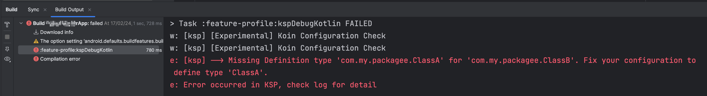

# Koin-Annotations

## Declarando dependências com Koin
Através deste artigo você irá **aprender** todas as formas de **como realizar as declarações de dependências utilizando** o Koin - Koin DSL, Constructor DSL e finalmente o poderosíssimo **Koin Annotations**.

### Koin DSL
Desta forma declaramos o módulo Koin e inicializamos os construtores de maneira explícita, invocando o famoso `get()` do Koin.

Exemplo:
```
class ClassA()
class ClassB(val a: ClassA)

val myModule = module {
    single { ClassA() }
    single { ClassB(a = get()) }
}
```

### Constructor DSL
Desta maneira o trabalho fica bem mais simples, pois não precisamos declarar de maneira explícita os parâmetros dos construtores.

Exemplo:
```
class ClassA()
class ClassB(val a: ClassA)

val myModule = module {
    singleOf(::ClassA)
    singleOf(::ClassB)
}
```

### Anotações
E por fim, chegamos onde a mágica realmente acontece, pois podemos deixar de usar (ou não) a declaração de dependências dentro de um módulo Koin. Apenas utilizando as anotações nas classes das nossas dependências.

Exemplo:
```
@Single
class ClassA()

@Factory
class ClassB(val a: ClassA)

@KoinViewModel
class MyViewModel(b: ClassB): ViewModel()

@KoinWorker
class UploadFiles: WorkManager()
```

Também é possível utilizar escopos e propriedades nas suas anotações, para mais detalhes consulte o guia do Koin Annotations [aqui](https://insert-koin.io/files/Koin-CheatSheet-2023.pdf). 

## Koin Annotations
Até aqui acredito que já tenham percebido o quão poderoso é o Koin Annotations, e também o quão é parecido com outros players do mercado, como o Dagger e o Hilt, certo?

O _Koin Annotations_ funciona de maneira adicional aos projetos Kotlin que fazem o uso do Koin. Sendo integrável a projetos já existentes e também há novos projetos.

Com a adoção do _Koin Annotations_ além de deixarmos o código escrito de uma maneira mais simples através de anotações, ainda podemos fazer o uso de um recurso que costuma ser o motivo de muitas queixas contrárias ao uso do Koin, que é a verificação das dependências em tempo de compilação!


## Compile Safety
Com este recurso é possível validar todas as dependências em tempo de compilação tal qual o Hilt ou o Dagger faz. Apenas adicionando uma linha de código `ksp {  arg("KOIN_CONFIG_CHECK", "true") }`.

Segundo a [Kotzilla](https://www.kotzilla.io/), empresa responsável por manter e distribuir o Koin, o tempo de compilação do _Koin Annotations_ é 75% mais rápido que o Dagger ([fonte](https://www.linkedin.com/feed/update/urn:li:activity:7160561406608605185/)).

O _compile safety_ é um recurso **ainda experimental**. Mas tenho aplicado-o em um projeto de Server-Driven UI, no core do SDK a ser utilizado pelo _client-side_ android. Em mais de 1 mês de uso não tive problemas. 

É válido lembrar que o _compile safety_ é configurável então pode ser habilitado ou desabilitado a qualquer momento via arquivo gradle - o padrão é `false`/desabilitado. 

Um ponto negativo, na minha opinião, é que o _compile safety_ não consegue enxergar as dependências declaradas em Koin DSL ou Constructor DSL.

Abaixo temos um exemplo de erro ao tentar compilar um projeto contendo o recurso habilitado e uma dependência não ~~mapeada~~ anotada.



**Troubleshooting:** O Koin não conseguiu satisfazer a dependência de `ClassA` que era esperada no construtor de `ClassB`.  

## Mas e os meus módulos?
Por baixo do capô, o _Koin Annotations_ gerará um módulo que contém todas as dependências mapeadas. E pra usar este módulo no seu tradicional `startKoin` é muito simples, exemplo: 

```
// Usar o módulo default gerado pelo Koin Annotations
import org.koin.ksp.generated.*

fun main() {
    startKoin { defaultModule() }
}

// Cenário com N módulos
fun main() {
    startKoin { modules(defaultModule, moduleA, moduleB, existingModule) }
}
```
### Mas e a organização?
Se você pensar em um projeto muito grande, com várias dependências, o módulo default pode não soar como algo muito organizado.
Para evitar que o _Koin Annotations_ gere este módulo basta desativar esta configuração padrão com `ksp {  arg("KOIN_DEFAULT_MODULE", "false") }`.

E neste caso, deveremos passar a declarar o uso dos módulos gerados pelas anotações. Vide os exemplos abaixo.

Módulo Koin com Koin Annotations:
```
@Module
class MyGiantModule
```

Utilizando o módulo gerado:
```
import org.koin.ksp.generated.*

fun main() {
    startKoin { modules(MyGiantModule().module) }
}
```

### Como declarar as dependências de cada @Module?
Agora vejamos mais uma anotação para o seu módulo, a `@ComponentScan`. Ela fará com que todos as dependências declaradas no mesmo package e subpackages sejam mapeadas para o seu `@Module`. Veja o exemplo a seguir:
```
@Module
class MyModule
```

Você também pode especificar o package que deverá ser observado para mapear as dependências. Da seguinte maneira:
```
@Module
@ComponentScan("com.my.app")
class MyModule
```

Ainda é possível declarar dependências diretas no seu módulo anotado utilizando funções do Kotlin.
```
@Module
@ComponentScan("com.my.app")
class MyModule {

    @Factory
    fun service(retrofit: Retrofit): ServiceAPI {
        return retrofit.create(ServiceAPI::class.java)
    }

}
```

### Mas e se eu precisar de mais um @Module?
A inclusão de módulos continua funcionando com as anotações, da seguinte forma:
```
@Module
class ModuleA

@Module(includes = [ModuleA::class])
class ModuleB
```

E neste caso poderíamos utilizar da seguinte forma:
```
import org.koin.ksp.generated.*

fun main() {
    startKoin {
        modules(
          // Irá carregar o ModuleB e o ModuleA
          ModuleB().module
        )
    }
}
```

## Conclusão
O _Koin Annotations_ pode ser utilizados em novos projetos e em projetos já existentes. Além disto ele traz uma maneira bastante idiomática para se trabalhar com injeção de dependência em Kotlin. 

Acredito que este era o último passo que faltava para o Koin fazer brilhar os olhos de qualquer desenvolvedor Kotlin! 
E só mais uma coisa, o _Koin Annotations_ não é específico da plataforma Android, ele também funciona em projetos multiplataformas. 

## Próximos passos
Ainda há mais temas para serem cobertos em relação ao _Koin Annotations_, por exemplo: especificar o binding de uma dependência, injetar um parâmetro, injetar uma dependência `lazy`, obter uma lista de dependências de um mesmo tipo, etc.
Para estes e outros temas consulte a [documentação oficial do Koin Annotations](https://insert-koin.io/docs/reference/koin-annotations/start).

Em breve farei um novo artigo demostrando como adicionar o _Koin Annotations_ a um projeto que já trabalha com o Koin.
